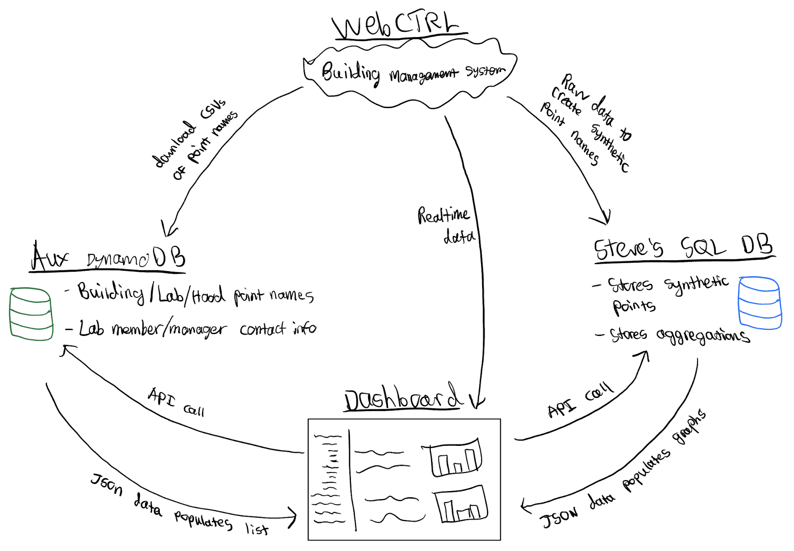
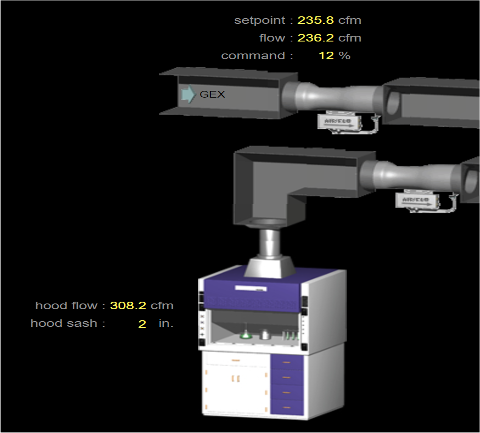

# ESW Cornell Fume Hood Energy Dashboard
## About
In partnership with the Campus Sustainability Office, the Fume Hood Energy Dashboard sub-team on Engineers for a Sustainable World — Cornell aims to reduce the energy usage of fume hoods at Cornell.

Fume hoods, while a necessary safety device, are one of the most energy intensive devices on campus since they replace heated air from inside the room with cold air from outdoors.  Through analyzing historical data and conducting interviews with lab managers and members, we've found that many lab members forget to close their fume hoods when they're finished using them.

Our goal is to create a web dashboard that displays real-time and historical energy usage of each fume hood on campus, which could be used to identify fume hoods that are left open unnecessarily. The dashboard will also facilitate inter-lab competitions for energy reduction and automated emails to motivate and remind lab members to close their fume hoods.

## Technical Overview

### WebCTRL
The ultimate source of our data is WebCTRL, which is Cornell's Building Management System.  WebCTRL is a restricted web app that contains real-time and historical data for temperature setpoints, airflow, hot water/steam/chilled water flow, and more for most thermostats and HVAC devices in most buildings and rooms on Cornell's campus (it is very cool to dig around!).

WebCTRL also contains airflow and sash position (amount the fume hood is open) data for most of the 1,500+ laboratory fume hoods on campus.  This is what we are primarily interested in.

*A screenshot of WebCTRL's interface showing the current values for a fume hood's airflow and sash position*

#### Obtaining Data from WebCTRL
Luckily, Cornell's E&S IT team maintains an API that allows us to query  data from WebCTRL for our dashboard.

To query data from WebCTRL, we need to pass the API one of two sets of parameters, depending on the type of data being requested:
1. **For real-time data:**
    1. Device ID (e.g. `DEV:49317`)
    2. Object ID (e.g. `AI:4`)
2. **For historical data:**
    1. Point Name (e.g. `#biotech/biotech_4th_floor/fourth_floor_fume_hood_lab_spaces/lab_418_control/hood_sash`)
    2. Server (e.g. `biotech_main`)
    3. Start and End Date/Time
    4. Aggregation Type

*Note 1: Essentially, each device ID/object ID pair and each point name represents a different sensor that is being read.*

*Note 2: You can view the API spec for historical data [here](https://app.swaggerhub.com/apis-docs/Cornell-BACSI/EMCS-portal/1.0.0).*

Looking at the system diagram, we utilize the information available in WebCTRL in three ways:
1. To obtain the point names and structure of the Building-Lab-Hood relationships used in the DynamoDB database (see the **DynamoDB Database** section below)
2. To obtain realtime data directly in the dashboard
3. To obtain raw historical data that is used to create synthetic data (see the **Synthetic Points** section below)

### Displaying Data in the Dashboard

#### DynamoDB Database
We use a DynamoDB Database to store the relationships between buildings, labs, floors, and fume hoods, as well as the corresponding point names, device IDs, and object IDs for each hood.  We also use this database to store the names and emails of lab managers/members and their relationship to either a building or a lab.

This data is stored in DynamoDB, which is a no-SQL database, in a key-value structure with four "tables" (they are not actually tables in a no-SQL database): `buildings`, `labs`, `hoods`, and `occupants`.

We obtain the point names, device IDs, and object IDs from WebCTRL either by downloading and parsing a CSV from WebCTRL or by manually going through each lab in the WebCTRL interface and copy-pasting from there.  The method we use depends on how well-organized or complex the layout of the labs and naming scheme is in WebCTRL (it depends largely on the building).  Luckily, this is mostly just a one-time thing, and will require infrequent modifications in the future (e.g. if a building is built or renovated).

We then utilize this DynamoDB database to construct the sidebar of our dashboard and pass in the proper point names and device/object IDs to the API in our dashboard and synthetic points script (see below).

#### Synthetic Points
**A very important point (no pun intended) is that we DO NOT query the raw data directly from WebCTRL in our dashboard!**  Instead, we have a separate Python script that processes the raw data from WebCTRL into "synthetic points", or processed data bound to a new point name separate from WebCTRL (e.g. `Biotech.Floor_4.Lab_433.Hood_1.sashOpenTime.unocc`).  Then, we upload this data to a SQL database managed by E&S IT.  Currently, we run all of this manually, but eventually we would like to automate this script to run every 15 minutes for all fume hoods at Cornell.

To display the synthetic data in our dashboard, we query the synthetic point names in our dashboard in a similar way to the raw point names.

The two synthetic points we currently have are **Time Sash Left Open** and **Energy Usage**.

Why do we not just query the raw data directly in the dashboard?  There are a few reasons:
1. For some synthetic points, like energy usage, we need to query multiple raw datapoints (air flow, room temp, and outside temp).  Doing this in the dashboard would slow things down
2. We need to process the raw data into a form we want it.  For energy, we must do some thermodynamic calculations.  For the time sash left open, we only want to show datapoints where the hood has been left open more than 1.2 inches.  Doing this processing client-side can also slow things down.
3. WebCTRL's historical trend database only stores trends for a few years.  Using our own database means we can store the trends forever.

## Overview of relevant folders/files
1. `dash` - folder containing Plotly Dash related files
    1. `assets` - folder containing the Dash css file
        1. `site.css` - main css file used to style the dashboard
    2. `pages` - folder containing python files for each of the dashboard pages
        1. `app.py` - file that you run to initialize the dashboard
        2. `home.py` - the home page (landing page)
        3. `dashboard.py` - the main fume hood dashboard page
        4. `admin.py` - the admin page
2. `Add Data` - folder containing Jupyter Notebooks and files related to initializing and adding data to the dashboard
    1. `add_fumehood_data.ipynb` - code to pull data from WebCTRL, process it, and add the resulting synthetic data to the database.  Right now this needs to be done manually, but the goal is to automate this script to run every 15 mins for all fume hoods at Cornell.
    2. `dynamoDB.ipynb` - code to add data to the DynamoDB database.  This is only used for major additions; minor additions/edits will be done on the admin page

## Running the dashboard
1. Clone the repository
2. Install the latest version of the following Python packages (via pip or equivalent)
    1. `dash`
    2. `dash_bootstrap_components`
    3. `dash_treeview_antd`
    4. `dash_svg`
    5. `pandas`
    6. `numpy`
    7. `boto3`
    8. `feffery_antd_components`
    9. `dash_ag_grid`
3. cd into the `dash` folder and run `python app.py`
    1. You should see something like `Dash is running on http://127.0.0.1:8055/` in the terminal.  Copy-paste this URL into a web browser to load the page.
        - If you get an error, you may not have all packages installed correctly.  Please reach out to rf377@cornell.edu for assistance.
4. Alternately, use docker to run the dashboard server in a container. You will need to have docker installed to make this work.
    1. `docker build -t fume-hood-dashboard .`
    2. `docker run -dp 8055:8055 fume-hood-dashboard`
